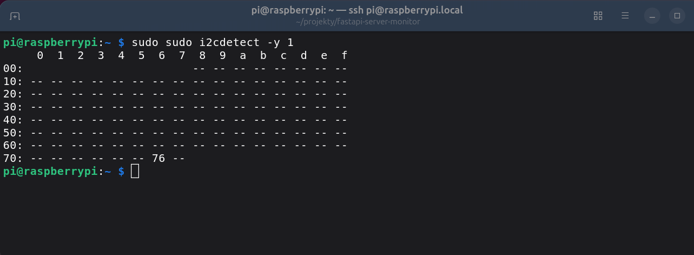
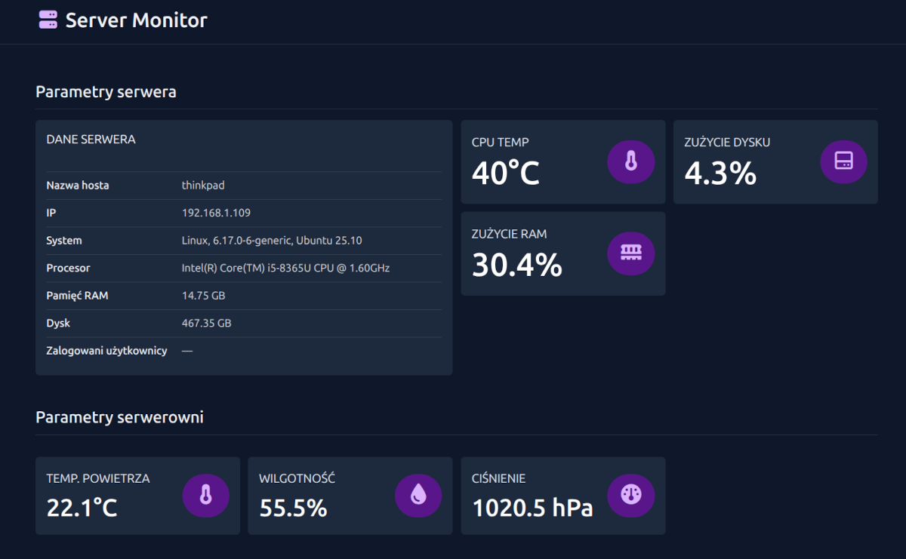

+++
title = 'Mini-monitor środowiska z Raspberry Pi i czujnikiem BME280'
date = 2025-11-11T12:44:02+01:00
draft = false
avatar = "/images/avatar.webp"
description = "Początkowo mój homelab opierał się o Raspberry Pi. Z czasem zastąpił go minipc z Proxmoxem, a malinka poszła w kont. Ostatnio wpadłem na pomysł, żeby ją odkurzyć i zrobić z niej urządzenie do zbierania danych z otoczenia. Zacząłem więc od prostego eksperymentu: podłączyłem czujnik BME280, który potrafi mierzyć temperaturę, wilgotność i ciśnienie."
author = "Arkadiusz Kulewicz"
image = "images/rpi_bme280.webp"
categories = ["monitoring"]
+++

## Wprowadzenie

Początkowo mój homelab opierał się o Raspberry Pi. Z czasem zastąpił go minipc z Proxmoxem, a malinka poszła w kont. Ostatnio wpadłem na pomysł, żeby ją odkurzyć i zrobić z niej urządzenie do zbierania danych z otoczenia. Zacząłem więc od prostego eksperymentu: podłączyłem **czujnik BME280**, który potrafi mierzyć temperaturę, wilgotność i ciśnienie.

Nie miałem wcześniej doświadczenia z magistralą **I2C**, więc był to dobry pretekst, żeby ją lepiej poznać. 

## Niezbędne narzędzia

Do zbudowania systemu monitorowania środowiska wykorzystałem:

- **Raspberry Pi 4**, 
- **czujnik BME280 (wersja I2C)** - czujnik można kupić za kilka złotych na chińskich portalach sprzedażowych. Jednak trzeba zwrócić uwagę, że większość czujników jest sprzedawanych z niewlutowanymi złączami pinów. Nie miałem lutownicy, więc zapłaciłem trochę drożej i kupiłem [BME280 z przylutowanym złączem](https://botland.com.pl/czujniki-cisnienia/16534-bme280-czujnik-wilgotnosci-temperatury-oraz-cisnienia-110kpa-i2c-spi-33v-wlutowane-zlacza-5904422378189.html),
- **cztery przewody połączeniowe**,  
- **Python 3 i biblioteka do obsługi czujnika**.  

## Konfiguracja i testy

Pierwszą czynnością było podłączenie czujnika do Raspberry Pi. Współpraca urządzeń odbywa się przez magistralę komunikacyjną I2C. Schematów w sieci jest pełno. Ja zrobiłem to tak:

- VCC → 3.3 V
- GND → GND
- SDA → SDA (GPIO 2)
- SCL → SCL (GPIO 3)

Po podłączeniu czujnika do komputera sprawdziłem, czy komunikacja przez I2C jest włączona. 

```bash
sudo raspi-config  
# wybierz: Interfacing Options → I2C → Enable  
```

Następnie zrestartowałem malinę:

```bash
sudo reboot
```

Po ponownym uruchomieniu komputera określiłem adres czujnika w magistrali I2C. W tym celu wydałem polecenie:

```bash
sudo i2cdetect -y 1
```

Otrzymałem adres urządzenia:



Teraz mogłem przejść do testów. Na początku utworzyłem folder testowy oraz środowisko wirtualne (venv):

```bash
mkdir rpi-bme280
cd rpi-bme280
python3 -m venv venv
source venv/bin/activate
``` 

Następnie pobrałem bibliotekę [RPi.bme280](https://pypi.org/project/RPi.bme280/) służącą do sterowania czujnikiem BM280 przez I2C :

```bash
pip install RPi.bme280
```

Do testów posłużyłem się gotowym kodem ze [strony biblioteki RPi.bme280](https://pypi.org/project/RPi.bme280/). W tym celu utworzułem plik `main.py`, w którym umieściłem poniższy kod:

```python
import smbus2
import bme280

port = 1
address = 0x76 
bus = smbus2.SMBus(port)

calibration_params = bme280.load_calibration_params(bus, address)

# the sample method will take a single reading and return a
# compensated_reading object
data = bme280.sample(bus, address, calibration_params)

# the compensated_reading class has the following attributes
print(data.id)
print(data.timestamp)
print(data.temperature)
print(data.pressure)
print(data.humidity)

# there is a handy string representation too
print(data)
```

Niestety, pierwsze uruchomienie zakończyło się błędem. Okazało się, że trzeba dodać użytkownika do grupy i2c:

```bash
sudo usermod -aG i2c $USER
newgrp i2c
```

Kolejna próba i sukces! Efektem działania programu były takie oto dane:


Przekonany o tym, że wszystko działa jak należy, mogłem przejść do docelowego projektu.

## Właściwy projekt

Dotychczasowe działania miały na celu wyłącznie podłączenie czujnika, jego konfigurację i przetestowanie jego działania.

Z racji tego, że wyniki pomiarów mogły przydać mi się w kilku projektach (np. system monitoringu serwerowni, dashboard wyświetlający temperaturę, ciśnienie i wilgotność w mieszkaniu) najlepszym wyjściem było ich udostępnienie w formacje JSON przez API. Dzięki temu mogłem je łatwo wykorzystać w innych aplikacjach.

Tak powstała **aplikacja [rpi-bme280-env-monitor](https://github.com/akulewicz/rpi-bme280-env-monitor)**, pobierającą dane z czujnika i wystawiającą je przez API. Napisałem ją w pythonowym frameworku **FastAPI**. Po stronie Raspberry Pi uruchomiony jest prosty serwis API. Jego zadanie jest bardzo konkretne — po wejściu na endpoint /env zwrócić aktualne dane z czujnika BME280.

Logika aplikacji jest dosyć prosta i opiera się tak naprawę na jednym serwisie. Serwis ten zawiera funkcję `read_bme280_data()`, która pobiera i zwraca dane z czujnika. 

```python
#app/services/bme280_service.py

import smbus2
import bme280
import logging

logger = logging.getLogger(__name__)

port = 1
address = 0x76
bus = smbus2.SMBus(port)

def read_bme280_data() -> dict:
    """Odczytuje temperaturę, wilgotność i ciśnienie z czujnika BME280."""    
    try:
        calibration_params = bme280.load_calibration_params(bus, address)
        data = bme280.sample(bus, address, calibration_params)
        return {
            "temperature": round(data.temperature, 2),
            "humidity": round(data.humidity, 2),
            "pressure": round(data.pressure, 2)
        }
    except Exception as e:
        logger.warning(f"Nie udało sie odczytać danych z czujnika BME280: {e}")
        return {}
```

W efekcie, po wejściu na endpoint /env aplikacja zwraca dane w formacie JSON, np.:

```json
{
    "temperature": 21.37,
    "humidity": 44.2,
    "pressure": 1009.5
}
```

Jeśli odczyt z czujnika się nie powiedzie (np. urządzenie jest odłączone albo brak dostępu do magistrali I2C), funkcja `read_bme280_data()` zwraca pusty słownik {}.

FastAPI rozpozna to i zwróci odpowiedź zgodną z modelem ```EnvData```, czyli:

```json
{
    "temperature": null,
    "humidity": null,
    "pressure": null
}
```

Taka konstrukcja aplikacji pozwala na łatwe wykorzystanie danych w innych aplikacjach. Przykładem może być napisany przeze mnie **[FastAPI Server Monitor](https://github.com/akulewicz/fastapi-server-monitor)**, wykorzystujący dane z czujnika BME280, pobrane przez ww. API. Jest to aplikacja do monitorowania serwera i środowiska systemowego, oferująca prosty dashboard w przeglądarce. Umożliwia podgląd temperatury CPU, użycia pamięci i dysku, informacji o systemie, użytkownikach oraz danych z czujnika BME280 podłączonego do Raspberry Pi.

Aplikacja prezentuje się następująco:




## Podsumowanie

Ten projekt świetnie pasuje do określenia "mała rzecz, a cieszy". Dzięki Raspberry Pi, czujnikowi BME280 i kilkudziesięciu linijkom kodu w Pythonie możemy w czasie rzeczywistym odczytywać temperaturę, wilgotność i ciśnienie z Raspberry Pi. FastAPI pełni tu rolę lekkiego serwera API, który udostępnia dane w czytelnym formacie JSON — gotowym do wykorzystania w aplikacjach webowych, dashboardach lub systemach monitoringu domowego.

Taki projekt to świetny punkt wyjścia do dalszych eksperymentów. Ja już np. widzę pierwsze zastosowanie w archiwum zakładowym. Zgodnie z obowiązującymi przepisami, dokumentacja osobowa i płacowa pracowników musi być przechowywana w odpowiednich warunkach (temperatura 12-20'C, wilgotność 45-60%). Pracownicy archiwów powinni dokonywać regularnych pomiary tych parametrów. Jeśli już to robią, to często pomiary wykonują ręcznie i zapisują dane w excelu. A wystarczy do mojej aplikacji dodać zapisywanie wyników pomiarów do bazy danych oraz prosty frontend i mamy w pełni zautomatyzowany system pomiarów. 


