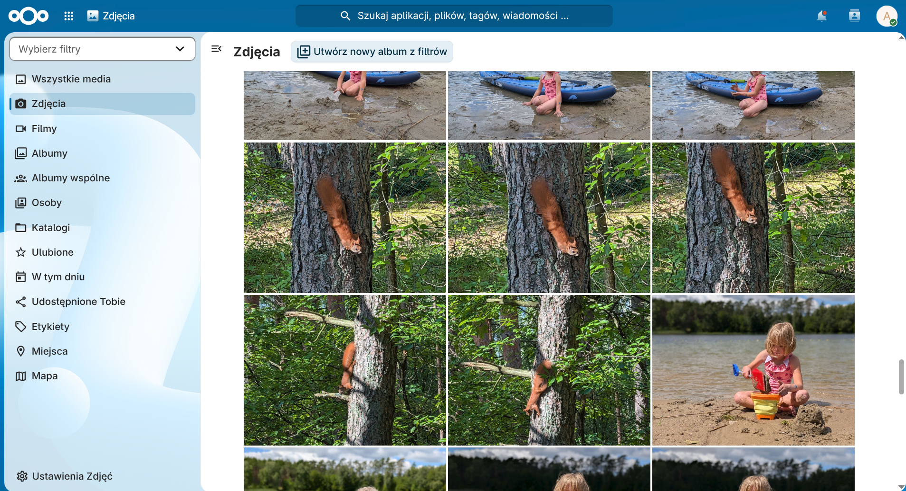

+++
title = 'Nextcloud, czyli jak postawiłem własną chmurę'
date = 2026-09-17T18:56:40+02:00
draft = false
avatar = "/images/avatar.webp"
description = "Co zrobiłbyś, gdybyś z dnia na dzień stracił dostęp do skrzynki e-mail, dysku w chmurze i archiwum zdjęć? Bez ostrzeżenia i bez szans na kontakt z człowiekiem po drugiej stronie. Odzyskiwanie takiego konta - o ile w ogóle się uda - to w najlepszym razie tygodnie stresu i straconego czasu. Dochodzi do tego świadomość, że komercyjni dostawcy stale skanują nasze prywatne pliki. Rozwiązaniem tego problemu jest własna chmura. Ja postanowiłem uniezależnić się od technologicznych gigantów i uruchomiłem własną instancję Nextclouda."
author = "Arkadiusz Kulewicz"
image = "images/nextcloud.webp"
categories = ["homelab"]
+++

Co zrobiłbyś, gdybyś z dnia na dzień stracił dostęp do skrzynki e-mail, dysku w chmurze i archiwum zdjęć? Bez ostrzeżenia i bez szans na kontakt z człowiekiem po drugiej stronie. Odzyskiwanie takiego konta - o ile w ogóle się uda - to w najlepszym razie tygodnie stresu i straconego czasu. Dochodzi do tego świadomość, że komercyjni dostawcy stale skanują nasze prywatne pliki. Rozwiązaniem tego problemu jest własna chmura. Ja postanowiłem uniezależnić się od technologicznych gigantów i uruchomiłem własną instancję Nextclouda.

W ostatnich latach chmury zagościły na dobre w naszym życiu. Przechowujemy w nich naszą pocztę e-mail, zdjęcia oraz ważne dokumenty. Robimy to wierząc ślepo, że nasze dane są tam bezpieczne. Większość z nas pogodziła się z tym (lub jest nieświadoma), że nasze zasoby nie są szyfrowane end-to-end i big techy mają do nich dostęp, wykorzystując je w bliżej nieokreślony sposób. Ale mało kto zakłada scenariusz, że może stracić dostęp do swoich danych. A to błąd ;)

[Kilka lat temu "New York Times" przytoczył sytuację ojca, który wysłał personelowi medycznemu zdjęcie pachwiny dziecka](https://www.nytimes.com/2022/08/21/technology/google-surveillance-toddler-photo.html). Zdjęcia zostały wykonane na prośbę pielęgniarki. Dwa dni po zrobieniu zdjęć mężczyzna otrzymał powiadomienie od Google, że jego konta zostały zablokowane z powodu szkodliwych treści. W skrócie automat uznał, że to mogą być treści pedofilskie.

Ojciec stracił dostęp do swojej poczty e-mail, kontaktów, zdjęć, a nawet numeru telefonu. Google odrzuciło prośbę o ponowne otwarcie konta, nawet po tym, jak policja stwierdziła, że nie doszło do przestępstwa.

Takich historii jest pełno. Zdarzały się zarówno Google, jak i Microsoftowi.

Problem polega na tym, że utrata konta Google lub Microsoft to nie tylko utrata dostępu do chmury na pliki - to natychmiastowe odcięcie od poczty e-mail, kontaktów, zdjęć, kalendarza oraz kopii zapasowych.

## Rozwiązanie - własna chmura

Jak się bronić przed utratą danych i naruszeniem prywatności przez dostawców usług chmurowych? Najlepiej jest się od nich uniezależnić. Ja zdecydowałem się na własną chmurę w oparciu o Nextcloud postawiony na lokalnej maszynie oraz szyfrowane połączenie przez Tailscale zapewniające bezpieczny dostęp z dowolnego miejsca bez wystawiania usług bezpośrednio na publiczny internet.

**[Nextcloud](https://nextcloud.com/)** to jedno z najbardziej dojrzałych darmowych rozwiązań typu self-hosted, które zastępuje cały ekosystem Google czy Microsoft 365. Oferuje nie tylko klasyczny dysk sieciowy z automatyczną synchronizacją zdjęć i plików z telefonu i komputera, ale również wbudowaną edycję dokumentów, kalendarz, kontakty czy własne notatki.



Co najważniejsze - mamy pełną kontrolę nad strukturą katalogów i uprawnieniami. Dane fizycznie leżą na naszym dysku, dzięki czemu żaden skrypt analizujący treść nie ma do nich dostępu, a limity miejsca zależą wyłącznie od pojemności dysków podłączonych do naszego serwera.

Oczywiście, własna chmura ma też wady. Trzeba samemu zająć się utrzymaniem i zabezpieczeniem usługi, jesteśmy uzależnieni od domowego łącza i zasilania oraz trzeba liczyć się z początkowymi nakładami na odpowiedniej wielkości dyski. No i trzeba poświęcić na to wszystko trochę czasu, ale to akurat sama przyjemność ;)

## Architektura rozwiązania

Aby zminimalizować ryzyko i zachować pełną kontrolę nad danymi, postawiłem na własne środowisko.

- **Hardware** - początkowo chciałem wykorzystać Raspberry Pi, ale malinka chwilami niedomagała. Widocznie Docker, Nextcloud i gigabajty zdjęć to dla niej stanowczo za dużo. Dlatego ostatecznie wykorzystałem energooszczędny Mini PC z Proxmox, na którym utworzyłem dedykowaną pod Nextcloud maszynę wirtualną. Do szczęścia przydałby się jeszcze UPS. Zastanawiałem się nad kupnem jakiegoś małego urządzenia, jednak nie za bardzo miałbym gdzie go upchać. Na szczęście mój Mini PC ma opcję automatycznego uruchomienia po włączeniu zasilania, więc w przypadku braku prądu ryzykuję najwyżej chwilową niedostępnością zasobów. W firmie nie ma szans na taką fuszerkę, ale w przypadku mojego zastosowania jestem w stanie zaakceptować takie ryzyko. Nawet jeśli awaria spowoduje problemy z bazą, to mam backup.
- **Dostęp sieciowy** - zamiast bawić się ze zmiennym IP, otwierać porty na routerze i wystawiać serwer na skanery oraz ataki brute-force, skorzystałem z **[Tailscale](https://tailscale.com/)**. Dzięki temu mam dostęp do plików z dowolnego miejsca i urządzenia (telefon, laptop) bez bezpośredniego eksponowania zasobów w internecie. I to przy minimalnym wysiłku, bo korzystanie z Tailscale jest bajecznie proste i przyjemne.

Jeśli ktoś jest zainteresowany instalacją Nextcloud i połączeniem przez Tailscale, to materiałów na ten temat jest w sieci pełno. Wychodzę z założenia, że ktoś, kto bierze się za stawianie tego typu usług da radę to zrobić na podstawie dostępnych treści. Wystarczy podstawowa znajomość tematyki sieci, obsługi systemu Linux oraz Dockera.

## Backup danych

Posiadanie serwera w domu to tylko część sukcesu. Trzeba jeszcze pomyśleć o backupie. Najprościej jest podłączyć drugi dysk i co jakiś czas robić kopie bezpieczeństwa. Ale wyłącznie lokalny backup to żaden backup. Aby zabezpieczyć się przed awarią, piorunami, kradzieżą urządzeń i innymi klęskami tego świata, konieczny jest backup poza domem.

Niestety, aktualnie jedyną wolną przestrzenią, w której taki backup mogłem zrobić, jest OneDrive. Jeśli ostatecznie uznam, że własny Nextcloud spełnia moje oczekiwania, to zdecyduję się na inne rozwiązanie, np. Blackblaze. Jednym z moich założeń było, żeby chronić prywatność zasobów. Dlatego, aby uniknąć skanowania plików przez algorytm dostawcy, założyłem, że backup przed wysłaniem będzie szyfrowany po stronie klienta.

Poradników na temat instalacji Nextcloud jest pełno. Natomiast praktycznie nikt nie mówi o tym, jak przygotować backupów plików. Dlatego musiałem rozłożyć ten proces na poszczególne etapy, żeby niczego ważnego nie pominąć.

Plan backupu wygląda następująco:

- **Włączenie trybu koserwacji** - przełączenie Nextclouda w maintenance:mode blokuje możliwość zapisu przez użytkowników na czas tworzenia kopii.
- **Zrzut bazy SQL** - wymuszenie bezpiecznego eksportu bazy danych MariaDB z kontenera.
- **Spakowanie do archiwum** - pakowanie danych aplikacji, wolumenu użytkowników oraz zrzutu SQL do jednego archiwum .tar.gz.
- **Szyfrowanie symetryczne (OpenSSL AES-256)** - zastosowanie standardu AES-256 z dociąganiem klucza za pomocą PBKDF2 (-pbkdf2). Niezaszyfrowany plik .tar.gz jest usuwany z dysku Mini PC.
- **Wyłączenie trybu koserwacji** - odblokowanie możliwości zapisu przez użytkowników.
- **Transport i rotacja (Rclone)** - przesłanie pliku .enc do wskazanego katalogu na OneDrive oraz automatyczne czyszczenie kopii starszych niż 7 dni (zarówno lokalnie, jak i w chmurze).

Oczywiście, założenie było takie, że ten backup wykonuje się cyklicznie (o 3:00 w nocy). Dlatego potrzebny był skrypt automatyzujący ten proces. Jestem masochistą i staram się sam pisać skrypty w bash, choć nieukrywam, że LLM-y kuszą ;) Utworzyłem więc pierwszą wersję skryptu - może nie była idealna, ale robiła robotę. Poprosiłem Gemini o jego weryfikację. Otrzymałem cenną wskazówkę, że w moim skrypcie jest pewna luka. Otóż przez `set -e`, w przypadku wysypania się skryptu, istniało ryzyko, że Nexctloud pozostanie w trybie konserwacji. Chat zarekomendował mi zastosowanie pułapki `trap`, która w razie wystąpienia jakiegokolwiek błędu (lub sygnału wyjścia) zagwarantuje wyłączenie trybu konserwacji i usunięcie plików tymczasowych. 

Przed uruchomieniem tego skryptu trzeba utworzyć plik .env:

```bash
DB_PASSWORD=TajneHasloDoBazy123
BACKUP_ENCRYPTION_PASSWORD=TajneHasloDoSzyfrowania123
```
Warto zmienić uprawnienia do pliku .env:

```bash
chmod 600 .env
```

Pozostała jeszcze konfiguracja Rclone (połączenie z OneDrive). W tym celu wpisujemy rclone config i przechodzimy przez kolejne kroki.

A tak wygląda cały skrypt:

```bash
#!/bin/bash

set -euo pipefail

# 1. Konfiguracja i środowisko
SCRIPT_DIR="/home/user/nextcloud"
BACKUP_DIR="/home/user/backups"
RCLONE_CONF="/home/user/.config/rclone/rclone.conf"
LOG_FILE="$BACKUP_DIR/backup.log"
DATE=$(date +%Y-%m-%d_%H%M%S)

# Wczytanie zmiennych środowiskowych
if [ -f "$SCRIPT_DIR/.env" ]; then
    set -a
    source "$SCRIPT_DIR/.env"
    set +a
else
    echo "[$(date)] BŁĄD: Brak pliku .env!" >> "$LOG_FILE"
    exit 1
fi

mkdir -p "$BACKUP_DIR"
exec >> "$LOG_FILE" 2>&1

echo "[$(date)] --- Rozpoczynam backup Nextcloud ---"

# 2. Tworzenie bezpiecznego katalogu tymczasowego
TMP_DIR=$(mktemp -d -p "$BACKUP_DIR" tmp_backup_XXXXXX)
chmod 700 "$TMP_DIR"

# Funkcja sprzątająca wywoływana przy wyjściu (np. w przypadku błędu)
cleanup() {
    echo "[$(date)] Sprzątanie środowiska i wyłączanie trybu konserwacji..."
    docker compose -f "$SCRIPT_DIR/docker-compose.yml" exec -T app su -s /bin/sh www-data -c "php occ maintenance:mode --off" || true
    rm -rf "$TMP_DIR"
}
trap cleanup EXIT

# 3. Włączenie trybu konserwacji
docker compose -f "$SCRIPT_DIR/docker-compose.yml" exec -T app su -s /bin/sh www-data -c "php occ maintenance:mode --on"

# 4. Zrzut bazy danych do bezpiecznego katalogu tymczasowego
DB_DUMP="$TMP_DIR/baza.sql"
docker compose -f "$SCRIPT_DIR/docker-compose.yml" exec -T -e MYSQL_PWD="$DB_PASSWORD" db mariadb-dump -u nextcloud nextcloud > "$DB_DUMP"

# 5. Pakowanie i szyfrowanie w locie (bez zapisywania czystego .tar.gz na dysku)
ENC_BACKUP_FILE="$BACKUP_DIR/nextcloud_backup_$DATE.tar.gz.enc"

tar -czf - -C "$SCRIPT_DIR" app data -C "$TMP_DIR" "baza.sql" | \
openssl enc -aes-256-cbc -salt -pbkdf2 -out "$ENC_BACKUP_FILE" -pass env:BACKUP_ENCRYPTION_PASSWORD

# 6. Wyłączenie trybu konserwacji
docker compose -f "$SCRIPT_DIR/docker-compose.yml" exec -T app su -s /bin/sh www-data -c "php occ maintenance:mode --off"

# 7. Wysyłka do chmury OneDrive i rotacja zdalna
rclone --config "$RCLONE_CONF" copy "$ENC_BACKUP_FILE" onedrive:backups/nextcloud
rclone --config "$RCLONE_CONF" delete onedrive:backups/nextcloud --min-age 7d

# 8. Lokalna czystka (usuwanie kopii lokalnych starszych niż 7 dni)
find "$BACKUP_DIR" -type f -name "*.tar.gz.enc" -mtime +7 -delete

echo "[$(date)] Backup zakończony sukcesem!"

```

Na koniec przyszła kolej na uruchomienie skrypty w ustalonym interwale (każdej nocy o godz. 3:00). W tym celu orzystałem z cron. Aby dodać uruchomienie programu do harmonogramu należy wpisać ```sudo crontab -e```, a następnie dopisać:

```bash
0 3 * * * cd /home/user/nextcloud && ./backup.sh >> /home/user/backups/backup.log 2>&1

```

## Jak to wszystko działa?

Muszę przyznać, że działa to bardzo dobrze. Z punktu widzenia codziennego użytkowania całe rozwiązanie działa praktycznie bezobsługowo i nie różni się niczym od korzystania z komercyjnych usług typu Google Drive czy OneDrive. Na telefonie mam zainstalowaną oficjalną aplikację Nextcloud. Każde zrobione zdjęcie lub nagrany film synchronizują się z serwerem. Dzięki aplikacji mogę też w wygodny sposób przeglądać zasoby oraz edytować dokumenty.

Na laptopie też działa to rewelacyjnie. Używam dystrybucji Fedora 44 z GNOME. Dodanie Nextcloud można zrobić z poziomu Ustawień systemowych, zakładka "Konta online". Tak naprawdę wystarczy podać adres serwera Nextcloud, wpisać hasło i mamy bezpośredni dostęp do plików w Nextcloud z poziomu systemu operacyjnego. Jest to mega wygodne.

Wdrożenie Nextcloud traktuję jako test. Używam go od prawie 3 tygodni. Po tym czasie mogę stwierdzić, że ani razu nie zatęskniłem za usługami Google czy Microsoft. Nextcloud daje mi porównywalne możliwości, ale przewyższa komercyjne rozwiązania pod względem prywatności danych. No i nikt nie zablokuje mi konta. No chyba, że coś zepsuję i sam sobie je zablokuję ;) Ale to już inna historia...