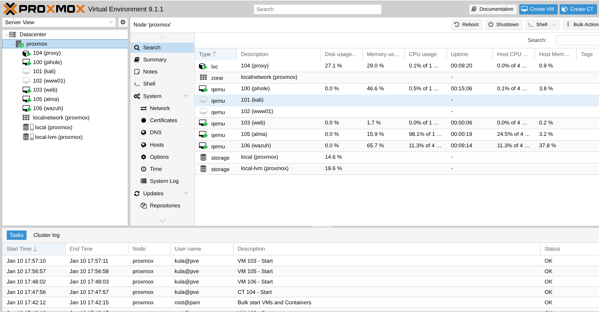
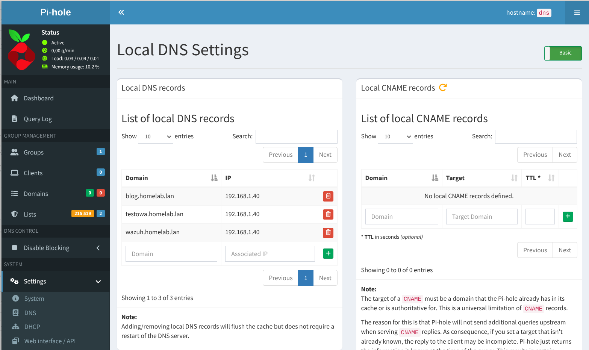
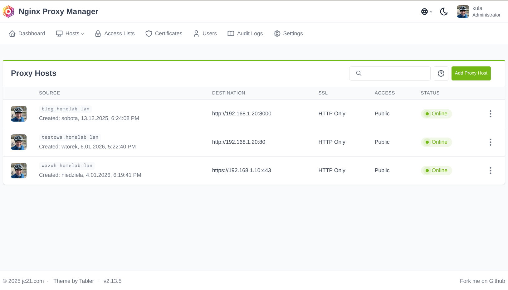

+++
title = 'Tworzymy homelab do nauki cyberbezpieczeństwa'
date = 2026-01-10T16:20:15+01:00
draft = false
avatar = "/images/avatar.webp"
description = "Planujesz zostać specjalistą od cyberbezpieczeństwa? A może chcesz iść w kierunku SysAdmin lub DevOps? Niezależnie od wybranej ścieżki, nie obejdzie się bez praktycznych umiejętności. Teoria jest ważna, ale czytanie o atakach, logach czy monitoringu bezpieczeństwa to jedno, a samodzielne postawienie, zabezpieczenie i utrzymanie systemów – to zupełnie inna historia. Rozwiązaniem jest domowy homelab."
author = "Arkadiusz Kulewicz"
image = ""
categories = ["homelab"]
+++

Planujesz zostać specjalistą od cyberbezpieczeństwa? A może chcesz iść w kierunku SysAdmin lub DevOps? Niezależnie od wybranej ścieżki, nie obejdzie się bez praktycznych umiejętności. Teoria jest ważna, ale czytanie o atakach, logach czy monitoringu bezpieczeństwa to jedno, a samodzielne postawienie, zabezpieczenie i utrzymanie systemów – to zupełnie inna historia. Rozwiązaniem jest domowy homelab.

Homelab to niewielkie, domowe środowisko, w którym można bezpiecznie eksperymentować, psuć rzeczy i uczyć się na błędach – bez presji, że „coś padnie na produkcji”. Co ważne, nie potrzeba na to milionów monet.

## **Założenia: prosto, tanio i realistycznie**

Na start proponuję przyjąć kilka prostych zasad:

* **Bez drogiego sprzętu** – to ma być narzędzie do nauki.
* **Rozwiązania zbliżone do realnych środowisk**.
* **Możliwość rozbudowy w przyszłości**.
* **Bez skomplikowanej struktury** – nie twórz na początku złożonych struktur, segmentacji sieci i usług. Najpierw zobacz w praktyce, jak działa sieć, DNS itp., a później wprowadzaj bardziej zaawansowane rozwiązania.

A tak mogłaby wyglądać struktura Twojego pierwszego homelab:

| VM / Kontener                       | Typ           | IP           | vCPU | RAM         | Dysk      | Nazwa domenowa                     |   
|-------------------------------------|---------------|--------------|------|-------------|-----------|------------------------------------|
| Proxmox host                        | fizyczny      | 192.168.1.5  | –    | -       | –         | proxmox.homelab.lan                |   
| Pi-hole                             | VM / kontener | 192.168.1.60 | 1    | 512 MB      | 4 GB      | dns.homelab.lan                    |   
| Wazuh Server                        | VM            | 192.168.1.10 | 2    | 8GB         | 60–80 GB  | wazuh.homelab.lan                  |   
| Reverse Proxy (Nginx Proxy Manager) | kontener      | 192.168.1.40 | 1    | 512 MB–1 GB | 10 GB     | proxy.homelab.lan                  |   
| Nextcloud                           | kontener      | 192.168.1.30 | 1    | 2 GB        | 50–100 GB | cloud.homelab.lan                  |   
| Web/API (FastAPI / WordPress)       | kontener      | 192.168.1.20 | 1    | 2 GB        | 20–30 GB  | web.homelab.lan / blog.homelab.lan |   
| Kali Linux                          | VM            | 192.168.1.50 | 1    | 2–4 GB      | 20–30 GB  | kali.homelab.lan                   |   

## **Sprzęt – minimum, które wystarcza**

Masz stary laptop lub komputer? Świetnie\! Ja zdecydowałem się na zakup mini PC GKMtec NUCBOX G3 z procesorem Intel N100, 16 GB RAM oraz 512 GB SSD.

Do tego mam jeszcze jeden dysk SSD o rozmiarze 512 GB przeznaczony na backup oraz Raspberry Pi 4 do różnych eksperymentów.

To nie jest sprzęt klasy enterprise, ale do nauki i domowych eksperymentów sprawdza się zaskakująco dobrze. Jest energooszczędny, cichy i pozwala uruchomić kilka usług jednocześnie bez większych problemów. I kosztował zaledwie kilka stówek :)

## **Proxmox jako fundament**

Jako bazę homelabu proponuję wybrać [Proxmox VE](https://www.proxmox.com/en/). Proxmox to platforma do zarządzania wirtualizacją. Tak po chłopsku - masz jeden serwer, na którym uruchamiasz Proxmox. I teraz możesz na tym jednym serwerze utworzyć maszyny wirtualne lub kontenery, w których zainstalujesz kilka serwerów z systemem Linux, Windows itd. Możesz łatwo nimi zarządzać, tworzyć klastry oraz robić backupu.

A dlaczego właśnie Proxmox?

* Umożliwia wygodne zarządzanie maszynami wirtualnymi i kontenerami.
* Pozwala łatwo robić snapshoty (uwierz mi – jest to zbawienne przy nauce).
* Daje bardzo dobrą widoczność zasobów.
* Jest powszechnie używany w homelabach, ma świetną dokumentację, a w sieci znajdziesz mnóstwo materiałów i tutoriali.
* Jest darmowy 🙂

## **Wazuh – monitoring bezpieczeństwa**

Czym jest [Wazuh](https://wazuh.com/)? Najprościej mówiąc, pomaga zobaczyć, co naprawdę dzieje się na serwerach i komputerach, zanim problem stanie się poważnym incydentem. W praktyce Wazuh zbiera i analizuje logi systemowe, zdarzenia bezpieczeństwa, próby nieautoryzowanego dostępu oraz zachowania, które mogą świadczyć o ataku lub błędzie konfiguracji.

Od razu zaznaczę – Wazuh to kobyła :) Jeśli jesteś na początku swojej drogi, może Cię trochę przytłoczyć. Ale warto się z nim zaprzyjaźnić. Nie trzeba od razu wchodzić na głęboką wodę – można poznawać go stopniowo. Postaw agenta Wazuh na poszczególnych hostach i obserwuj, co dzieje się w Twojej sieci.

## **Serwer na strony, usługi, API**

To będzie miejsce, w którym możesz trzymać swoje strony i aplikacje. Testuj na nim strony, ucz się Dockera itp. Możesz wykorzystywać go jako cel ataków i poligon do testowania zabezpieczeń.

## **Serwer DNS**

W wielu książkach i tutorialach dotyczących nauki administrowania sieciami i serwerami będziesz namawiany do korzystania z narzędzi typu BIND. Ja natomiast na pierwszy serwer DNS polecam [Pi-hole](https://pi-hole.net/).

Pi-hole raczej nie jest wykorzystywany w profesjonalnych rozwiązaniach, ale jest świetnym pierwszym serwerem DNS w homelabie. W prosty sposób pokazuje, jak ważną rolę DNS odgrywa w bezpieczeństwie i prywatności. Instalacja jest szybka, a czytelny panel webowy pozwala od razu zobaczyć, jakie domeny są odpytywane w sieci i które z nich są blokowane.

Pi-hole uczy podstaw monitorowania i analizy ruchu sieciowego. Logi DNS szybko pokazują, jak często aplikacje, systemy operacyjne czy urządzenia IoT komunikują się z zewnętrznymi serwisami.

Dodatkowo dostajemy w pakiecie domowy adblocker działający na poziomie całej sieci, a nie pojedynczej przeglądarki. Dzięki temu poprawiamy prywatność oraz blokujemy reklamy i trackery na wszystkich urządzeniach w naszej sieci.

## **Nginx Proxy Manager**

[Nginx Proxy Manager (NPM)](https://nginxproxymanager.com/) to narzędzie oparte na serwerze Nginx, który pełni rolę reverse proxy. NPM oferuje wygodny panel webowy, więc nawet początkujący powinien sobie poradzić. Oczywiście, gdy już załapiesz o co chodzi, warto zapoznać się z tradycyjnym, tekstowym Nginx.

Jak wykorzystać NPM w homelabie? Flow jest następujący:

* Urządzenie w sieci (np. laptop) – użytkownik wpisuje adres `blog.homelab.lan`.
* Pi-hole (DNS) – odpowiada na zapytanie DNS i wskazuje adres Nginx Proxy Managera (wszystkie domeny wskazują na jeden adres 192.168.1.40).

* Nginx Proxy Manager – przyjmuje połączenie i decyduje, do której usługi przekazać ruch (na podstawie domeny).

* Serwer – dopiero na końcu ruch trafia do właściwej maszyny lub kontenera.

Zastosowanie takiego rozwiązania pozwala łatwiej zapanować nad konfiguracją, ułatwia zarządzanie certyfikatami, zwiększa bezpieczeństwo oraz umożliwia monitorowanie ruchu.

Najbardziej podoba mi się skalowalność i porządek – dodanie nowej usługi sprowadza się do wpisu DNS w Pi-hole oraz nowego proxy hosta w Nginx Proxy Managerze.

## **VM z Kali Linux**

Możesz postawić na Proxmox maszynę wirtualną z [Kali Linux](https://www.kali.org/). Kali Linux to dystrybucja Linuksa stworzona z myślą o testach bezpieczeństwa. Zawiera gotowy zestaw narzędzi do analizy sieci, testów podatności i symulowania ataków, dzięki czemu nie trzeba instalować wszystkiego ręcznie.

Kali Linux będzie Twoim głównym orężem w testowaniu serwerów i usług w Twoim homelabie.

## **Podsumowanie**

Tak w skrócie może wyglądać Twój pierwszy homelab. Jest to środowisko w dużej mierze oparte na prostych narzędziach. Dzięki temu nie utoniesz w plikach konfiguracyjnych, zrozumiesz, jak wszystko działa i zdobędziesz podstawową wiedzę na temat działania usług sieciowych, protokołów, routingu, DNS itd. 

Z taką wiedzą łatwiej wejdziesz w profesjonalne i bardziej zaawansowane narzędzia.

Utworzenie maszyn wirtualnych i kontenerów z serwerami i usługami to dopiero początek zabawy. W kolejnym etapie warto pomyśleć o backupie danych, firewallach oraz innych rozwiązaniach wpływających na bezpieczeństwo. Próbuj, testuj i psuj do woli – to najlepszy sposób na naukę\!
