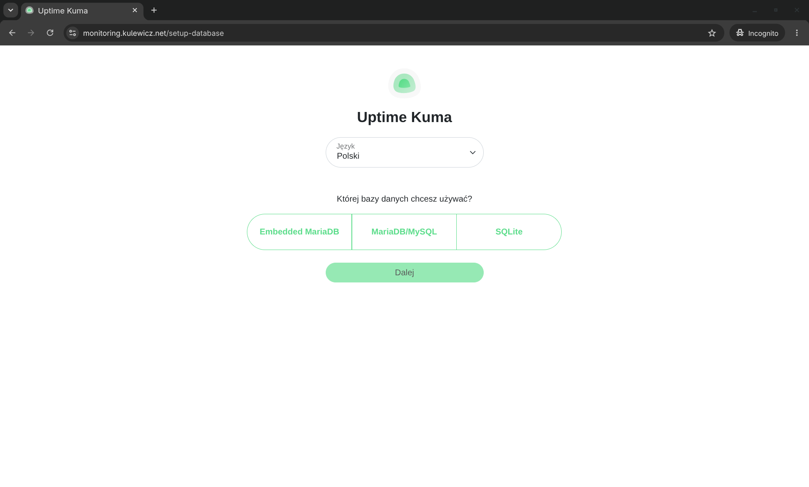
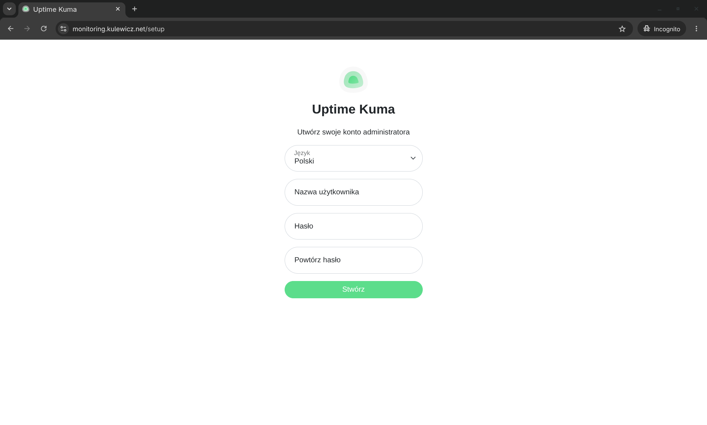
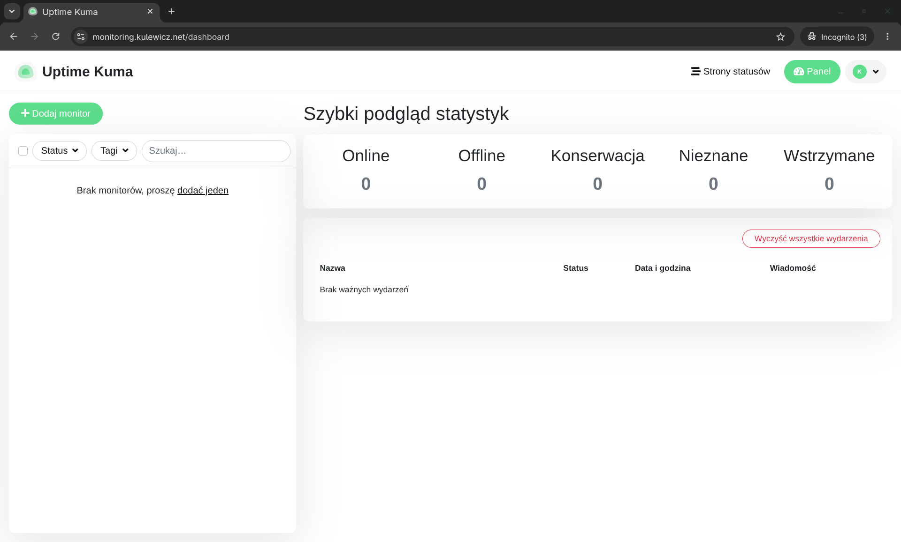
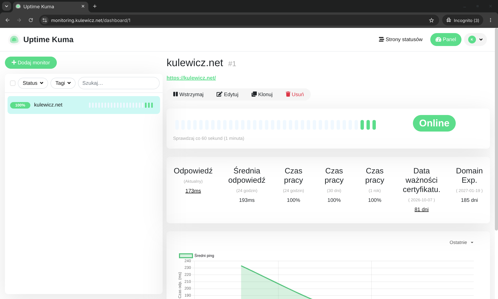

+++
title = 'Uptime Kuma na własnym VPS - instalacja i konfiguracja'
date = 2026-07-18T13:22:30+02:00
draft = false
avatar = "/images/avatar.webp"
description = "Współczesne aplikacje i serwisy internetowe wymagają ciągłej uwagi. Nawet najkrótsza przerwa w ich działaniu może oznaczać utratę czytelników, klientów lub po prostu nadszarpnięte zaufanie. Chociaż na rynku istnieje wiele gotowych platform do monitorowania statusu usług, to jednak większość z nich to prawdziwe kobyły. Do wielu zastosowań będą one nadmiarowe i warto pomyśleć o prostszym rozwiązaniu."
author = "Arkadiusz Kulewicz"
image = "images/kuma_img.png"
categories = ["monitoring"]
+++

Współczesne aplikacje i serwisy internetowe wymagają ciągłej uwagi. Nawet najkrótsza przerwa w ich działaniu może oznaczać utratę czytelników, klientów lub po prostu nadszarpnięte zaufanie. Chociaż na rynku istnieje wiele gotowych platform do monitorowania statusu usług, to jednak większość z nich to prawdziwe kobyły. Do wielu zastosowań będą one nadmiarowe i warto pomyśleć o prostszym rozwiązaniu.

Przyjrzymy się bliżej jednemu z najlepszych darmowych narzędzi z tego segmentu – **Uptime Kuma**. To lekka i funkcjonalna aplikacja, która monitoruje status usług i w razie potrzeby wyśle powiadomienie o awarii. Krok po kroku przejdziemy przez proces jej instalacji za pomocą Dockera, a także zmierzymy się z nieco bardziej zaawansowanym scenariuszem: uruchomieniem monitoringu na budżetowym serwerze VPS (Mikrus) z wykorzystaniem IPv6, Cloudflare jako reverse proxy oraz Nginx. Pokażę Ci również, jak poprawnie skonfigurować serwer, aby zachować autentyczne adresy IP użytkowników w logach.


## Instalacja

Proces instalacji jest szczegółowo opisany na [oficjalnej stronie projektu](https://uptimekuma.co/install-uptime-kuma-docker/). Ja zdecydowałem się na wdrożenie z wykorzystaniem Docker Compose, co znacząco ułatwia późniejsze aktualizacje i zarządzanie kontenerem.

Instalację przeprowadziłem na serwerze VPS z systemem operacyjnym Ubuntu, wykorzystując Docker Engine. Jeśli nie masz jeszcze zainstalowanego środowiska Docker na swoim serwerze, możesz to zrobić, [postępując zgodnie z dokumentacją Dockera](https://docs.docker.com/engine/install/).

Jeśli środowisko Docker jest już gotowe, czas utworzyć dedykowany katalog dla plików konfiguracyjnych i danych Uptime Kuma oraz do niego przejść:

```bash
mkdir -p uptime-kuma && cd uptime-kuma
```

W kolejnym kroku należy utworzyć plik `docker-compose.yml`:

```bash
nano docker-compose.yml
```

Skorzystałem z gotowego kodu z oficjalnej dokumentacji, który po drobnych modyfikacjach wygląda następująco:

```yaml
services:
  uptime-kuma:
    image: louislam/uptime-kuma:2
    container_name: uptime-kuma
    restart: always
    ports:
      - "127.0.0.1:3001:3001"  
    volumes:
      - ./uptime-kuma-data:/app/data  
    environment:
      - TZ=Europe/Warsaw 
      - UMASK=0022 
    networks:
      - kuma_network  
    healthcheck:
      test: ["CMD", "curl", "-f", "http://localhost:3001"]
      interval: 30s
      retries: 3
      start_period: 10s
      timeout: 5s
    logging:
      driver: "json-file"
      options:
        max-size: "10m"
        max-file: "3"

networks:
  kuma_network:
    driver: bridge
```

Po zapisaniu pliku (w edytorze nano: `Ctrl + O`, `Enter`, a następnie `Ctrl + X`) należy uruchomić kontener z aplikacją w tle:

```bash
docker compose up -d
```

Po chwili aplikacja powinna zainicjalizować swoje działanie i być dostępna pod adresem:

```
http://<adres-ip-twojego-serwera>:3001
```

## Uruchomienie Uptime Kuma na VPS Mikrus

W moim przypadku nie poszło tak łatwo, ponieważ jako docelowe środowisko dla Uptime Kuma wybrałem [serwer Mikrus](https://mikr.us/). Mikrusy wykorzystują adresację IPv6, a nie wszyscy dostawcy internetu w Polsce oferują pełną obsługę protokołu IPv6 dla użytkowników końcowych. 

Istnieje kilka sposobów na rozwiązanie tego problemu i wystawienie usługi na świat. Jednym z prostszych jest podpięcie własnej domeny do serwera przy pomocy darmowej usługi Cloudflare, która zadziała jako proxy tłumaczące ruch IPv4 na IPv6. Dokładną instrukcję, jak to zrobić, znajdziesz bezpośrednio w [dokumentacji Mikrusa](https://wiki.mikr.us/podpiecie_domeny_przez_cloudflare/).

Po skierowaniu domeny na serwer, w kolejnym kroku zainstalowałem serwer WWW Nginx, który posłuży jako reverse proxy:

```bash
sudo apt update && sudo apt install nginx-extras -y
```

Następnie utworzyłem dedykowany plik konfiguracyjny dla mojej subdomeny:

```bash
cd /etc/nginx/sites-available
sudo nano monitoring
```

Treść pliku konfiguracyjnego prezentuje się następująco:

```nginx
server {
    listen 80;
    listen [::]:80;
    server_name monitoring.kulewicz.net;

    location / {
        proxy_pass         http://127.0.0.1:3001;
        proxy_http_version 1.1;
        proxy_set_header   Upgrade $http_upgrade;
        proxy_set_header   Connection "upgrade";
        proxy_set_header   Host $host;
        proxy_set_header   X-Real-IP $remote_addr;
        proxy_set_header   X-Forwarded-For $proxy_add_x_forwarded_for;
        proxy_set_header   X-Forwarded-Proto $scheme;

        proxy_set_header   Sec-WebSocket-Key $http_sec_websocket_key;
        proxy_set_header   Sec-WebSocket-Version $http_sec_websocket_version;
        proxy_set_header   Sec-WebSocket-Extensions $http_sec_websocket_extensions;

        proxy_buffering    off;
    }

}
```

Po zapisaniu pliku musiałem aktywować nową konfigurację. Aby to zrobić, należy utworzyć dowiązanie symboliczne (link symboliczny) do katalogu `sites-enabled`:

```bash
sudo ln -s /etc/nginx/sites-available/monitoring /etc/nginx/sites-enabled/
```

Teraz mogłem przetestować poprawność składni konfiguracji i przeładować proces Nginxa:

```bash
sudo nginx -t
sudo nginx -s reload
```

Po wpisaniu w przeglądarce adresu `https://monitoring.kulewicz.net` poprawnie wyświetlił się panel Uptime Kuma. 

## Dodajemy logowanie prawdziwych adresów IP 

Ale to jeszcze nie koniec pracy! Ponieważ Cloudflare domyślnie proxyuje cały ruch, spodziewałem się, że analizując standardowe logi Nginxa, nie będę w stanie zweryfikować, z jakich realnych adresów IP generowane są odwiedziny. Szybka analiza pliku `/var/log/nginx/access.log` potwierdziła moje obawy – w logach widniały wyłącznie adresy IP należące do serwerów Cloudflare. A tak przecież być nie może. 🙂

```bash
2400:cb00:696:1000:5242:46dc:3e62:6071 - - [18/Jul/2026:08:21:04 +0000] "GET /setup-database-info HTTP/1.1" 304 0 "https://monitoring.kulewicz.net/setup-database" "Mozilla/5.0 (Macintosh; Intel Mac OS X 10_15_7) AppleWebKit/605.1.15 (KHTML, like Gecko) Version/26.5 Safari/605.1.15"
```

Całą operację „odzyskiwania prawdziwych IP” podzieliłem na trzy proste kroki.

### 1. Zmiana trybu szyfrowania w Cloudflare (Flexible -> Full (Strict))

Wspomniana wyżej dokumentacja Mikrusa wskazywała, aby w panelu Cloudflare wybrać tryb szyfrowania *Flexible*. Oznacza to, że ruch między przeglądarką użytkownika a Cloudflare jest w pełni szyfrowany (HTTPS), ale odcinek między Cloudflare a naszym Mikrusem leci już tradycyjnym, nieszyfrowanym protokołem HTTP na port 80. 

Aby to zmienić, przeszedłem do zakładki **SSL/TLS** w panelu administracyjnym Cloudflare i przełączyłem tryb na **Full (Strict)**. Od tego momentu Cloudflare bezwzględnie wymaga, aby nasz serwer nie tylko szyfrował ruch na bezpiecznym porcie 443, ale także legitymował się w pełni zaufanym, ważnym certyfikatem SSL.

### 2. Generowanie certyfikatu SSL za pomocą Certbota

Bezpośrednią konsekwencją wymuszenia trybu *Strict* była konieczność wdrożenia certyfikatu SSL na naszym serwerze Nginx. W tym celu skorzystałem z darmowego narzędzia Certbot dostarczanego przez Let's Encrypt.

Instalacja oraz samo generowanie certyfikatu są banalnie proste i ograniczają się do dwóch poleceń:

```bash
sudo apt install certbot python3-certbot-nginx -y
sudo certbot --nginx -d monitoring.kulewicz.net
```

Certbot automatycznie przejdzie proces weryfikacji własności domeny, wygeneruje niezbędne klucze kryptograficzne i – co najlepsze – sam odpowiednio zmodyfikuje pliki konfiguracyjne Nginxa w katalogu `sites-available`, otwierając bezpieczny port 443 oraz konfigurując przekierowania.

### 3. Konfiguracja modułu Real IP w Nginx

To jednak wciąż nie wszystko. Mimo wdrożenia SSL, Nginx w logach `access.log` nadal uparcie zapisywał adresy IP serwerów Cloudflare. Dlaczego? Ponieważ domyślnie interpretuje on bezpośrednie połączenie jako źródło ruchu. Aby rozwiązać ten problem, należało poinstruować Nginxa, by zaczął odczytywać specjalny nagłówek `CF-Connecting-IP`, który Cloudflare dokleja do każdego zapytania przesyłanego do serwera docelowego.

W tym celu poprosiłem Gemini o pomoc w przygotowaniu skryptu powłoki, który automatycznie pobierze aktualną listę zakresów IP Cloudflare i wygeneruje z nich globalną konfigurację dla serwera Nginx. Dlaczego nie wpisałem tych adresów na sztywno? Pula IP Cloudflare może się z czasem zmieniać, a taki skrypt mogę w prosty sposób podpiąć pod harmonogram zadań `cron`, zapewniając w pełni automatyczne aktualizacje.

```bash
sudo sh -c '
echo "# Cloudflare IPv4" > /etc/nginx/conf.d/cloudflare.conf
curl -s https://www.cloudflare.com/ips-v4 | sed "s/^/set_real_ip_from /;s/$/;/" >> /etc/nginx/conf.d/cloudflare.conf
echo "
# Cloudflare IPv6" >> /etc/nginx/conf.d/cloudflare.conf
curl -s https://www.cloudflare.com/ips-v6 | sed "s/^/set_real_ip_from /;s/$/;/" >> /etc/nginx/conf.d/cloudflare.conf
echo "
real_ip_header CF-Connecting-IP;" >> /etc/nginx/conf.d/cloudflare.conf
'
```

Na koniec wykonujemy szybki test nowej konfiguracji oraz przeładowanie Nginxa:

```bash
sudo nginx -t
sudo systemctl reload nginx
```

Nadeszła chwila prawdy – sprawdzam logi Nginxa za pomocą polecenia `sudo tail -f /var/log/nginx/access.log` i… pełen sukces! W logach zamiast serwerów proxy zaczęły pojawiać się rzeczywiste, publiczne adresy IP osób odwiedzających stronę. 

## Podstawowa konfiguracja Uptime Kuma

Konfigurację Cloudflare i Nginxa mamy za sobą – możemy przejść do uruchomienia monitoringu. Po wejściu na stronę pojawi się okno, w którym należy dokonać wyboru języka oraz bazy danych. Ja wybrałem Embedded MariaDB.



Po wybraniu bazy danych należy podać nazwę użytkownika i hasło. 



Po wykonaniu powyższych czynności możemy zalogować się i wyświetli nam się dashboard.



Na koniec sprawdźmy jeszcze, czy monitoring działa. W tym celu klikamy **"Dodaj monitor"** i podajemy wymagane informacje. Na początkowe testy wystarczy:

- Rodzaj monitora: HTTP(s)
- Przyjazna nazwa: kulewicz.net
- URL: https://kulewicz.net
- Częstotliwość bicia serca: 60
- Prób: 2
- Zaznaczamy "Powiadomienie o wygaśnięciu certyfikatu".

Po zapisaniu zmian w naszym dashboardzie pojawią się informacje o statusie strony oraz dacie ważności certyfikatu i domeny.



## Podsumowanie

Wdrożenie własnego systemu monitoringu w oparciu o **Uptime Kuma** to doskonała alternatywa dla rozbudowanych i kosztownych platform komercyjnych. Dzięki wykorzystaniu Dockera proces instalacji samej aplikacji jest szybki i raczej mało skomplikowany.

W przypadku Mikrusa było trochę zabawy, ale im trudniej i więcej problemów, tym więcej człowiek się nauczy :)

A już w następnej części skupimy się możliwościach Uptime Kuma i skonfigurujemy automatyczne powiadomienia o awariach.