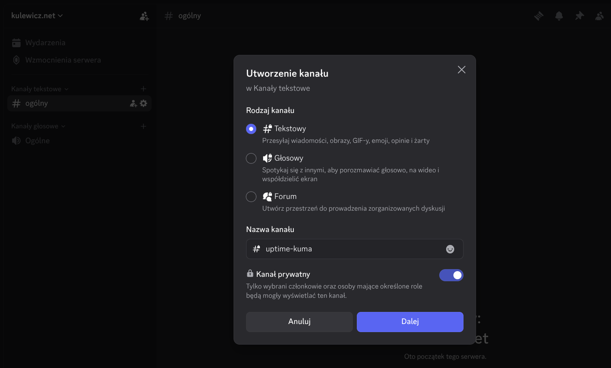
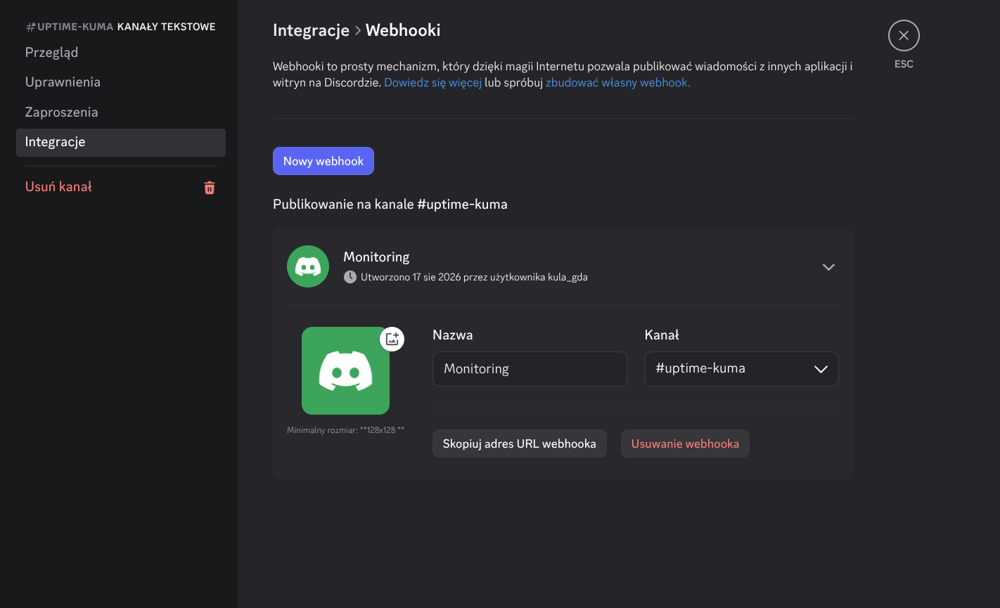
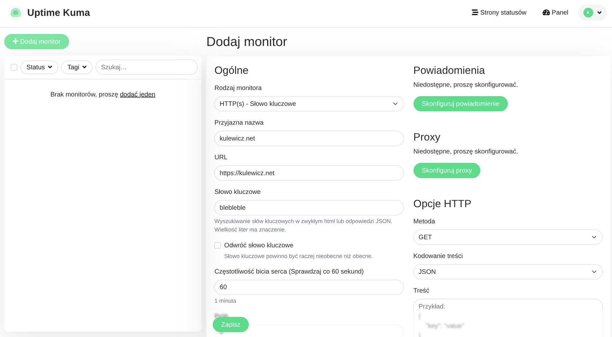
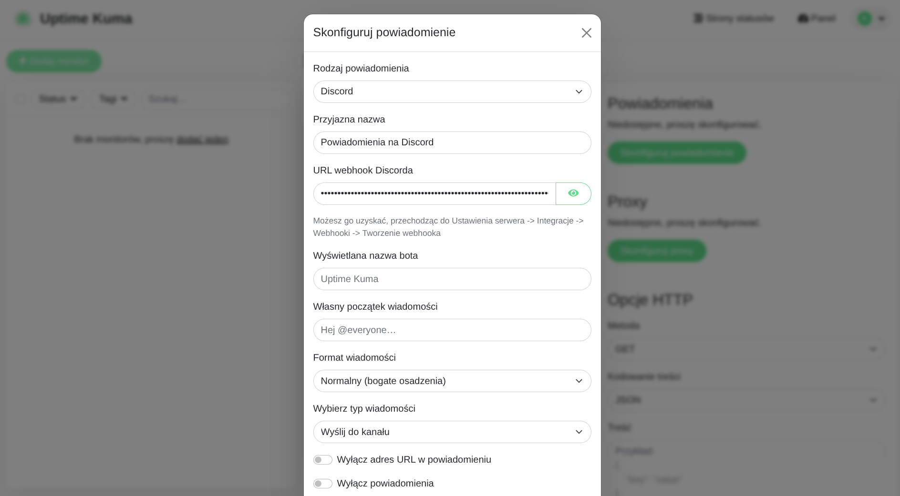
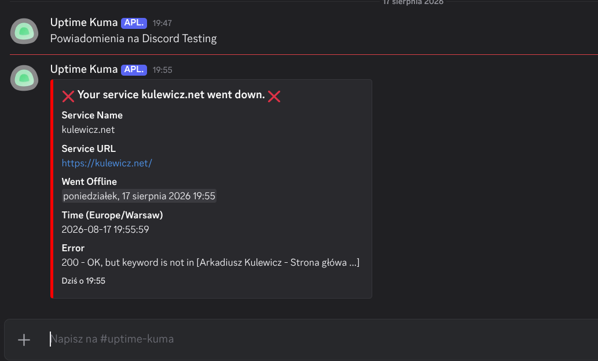

+++
title = 'Uptime Kuma na własnym VPS - konfiguracja powiadomień na Discord'
date = 2026-08-18T15:30:00+02:00
draft = false
avatar = "/images/avatar.webp"
description = "W poprzednim artykule krok po kroku przeszliśmy przez proces instalacji i wstępnej konfiguracji Uptime Kuma na własnym serwerze VPS. Sam panel i czytelne wykresy statusu usług to jednak dopiero połowa sukcesu. Kluczem do sprawnego reagowania na awarie jest natychmiastowe otrzymywanie informacji, gdy coś zaczyna szwankować."
author = "Arkadiusz Kulewicz"
image = "images/kuma_img.png"
categories = ["monitoring"]
+++

W [poprzednim artykule](https://kulewicz.net/blog/uptime-kuma-na-wlasnym-vps/) krok po kroku przeszliśmy przez proces instalacji i wstępnej konfiguracji Uptime Kuma na własnym serwerze VPS. Sam panel i czytelne wykresy statusu usług to jednak dopiero połowa sukcesu. Kluczem do sprawnego reagowania na awarie jest natychmiastowe otrzymywanie informacji, gdy coś zaczyna szwankować.

W tej części zajmiemy się konfiguracją automatycznych powiadomień. Jako kanał komunikacyjny wykorzystamy Discorda, który dzięki wbudowanym webhookom pozwala na błyskawiczne i proste przesyłanie alertów wprost na nasz serwer.

## Tworzenie kanału i webhooka na Discordzie

Na początku tworzymy kanał tekstowy na naszym serwerze Discord, w którym będą wyświetlały się powiadomienia z Uptime Kuma. W tym celu wybieramy "+" przy **Kanały tekstowe**, następnie wybieramy rodzaj kanału, wskazujemy nazwę kanału (np. uptime-kuma) oraz decydujemy, czy nasz kanał ma być prywatny (no raczej 😉).

W kolejnym kroku zostaniemy poproszeni o dodanie członków lub ról – na tym etapie możemy śmiało ten krok pominąć.

Mamy już utworzony dedykowany kanał dla naszych alertów. Przyszedł czas na zintegrowanie Discorda z Uptime Kuma. W tym celu skorzystamy z mechanizmu webhooków. Czym są webhooki? Najprościej mówiąc, webhooki to mechanizm powiadomień w czasie rzeczywistym. Zamiast ciągle pytać serwer: „Hej, czy coś się zmieniło?”, podajemy mu specjalny adres URL, pod który sam wysyła krótką wiadomość w momencie, gdy wydarzy się coś ważnego – na przykład gdy Twoja strona padnie.

Wchodzimy w ustawienia naszego nowo utworzonego kanału i wybieramy zakładkę **Integracje** → **Tworzenie webhooka**. Nadajemy nazwę naszemu webhookowi i zapisujemy zmiany. Teraz możemy skopiować wygenerowany URL webhooka, który wykorzystamy przy konfiguracji powiadomień w panelu Uptime Kuma.

## Konfiguracja powiadomień i testowanie w Uptime Kuma

Aby przetestować działanie alertów w praktyce, utworzymy nowy monitor. Tym razem jako rodzaj monitora wybierzemy **HTTP(s) – Słowo kluczowe**. To bardzo przydatny typ monitorowania – nie tylko sprawdza, czy dana strona odpowiada kodem HTTP 200, ale upewnia się również, że znajduje się na niej zdefiniowana fraza. Daje nam to pewność, że serwis nie tylko żyje, ale też serwuje właściwą zawartość. Przyda się, jak ktoś np. podmieni zawartość strony 😉

Ponieważ zależy nam na celowym wywołaniu alertu, w polu słowa kluczowego wpisujemy frazę, której na pewno nie ma na naszej stronie, np. `blebleble` ;-).

Następnie klikamy **Skonfiguruj powiadomienia**. Z rozwijanej listy *Rodzaj powiadomienia* wybieramy **Discord**, wpisujemy przyjazną nazwę dla tego powiadomienia i wklejamy wcześniej skopiowany URL webhooka z Discorda. W tym miejscu możemy dodatkowo dostosować sposób wyświetlania komunikatów. 

Przed zapisaniem konfiguracji warto kliknąć przycisk **Test**. Jeśli wszystko wprowadziliśmy poprawnie, na naszym kanale Discord powinniśmy natychmiast zobaczyć wiadomość testową: *„Powiadomienia na Discord Testing”*.

Gdy test zakończy się powodzeniem, zapisujemy zmiany w ustawieniach powiadomień, a następnie zapisujemy cały monitor.

Jeżeli w ustawieniach monitora użyliśmy słowa kluczowego, którego nie ma na stronie, Uptime Kuma po pierwszej próbie weryfikacji wykryje nieprawidłowość. Na naszym kanale Discord od razu pojawi się powiadomienie o awarii wraz ze szczegółami dotyczącymi czasu reakcji i braku oczekiwanej zawartości.

I to tyle! Dedykowany kanał z webhookiem na Discordzie to świetny, darmowy i niezawodny sposób na to, aby trzymać rękę na pulsie swoich usług bez konieczności ciągłego zaglądania do panelu administracyjnego. W analogiczny sposób możesz podpiąć inne powiadomienia – np. przez Telegrama, e-mail czy Gotify.